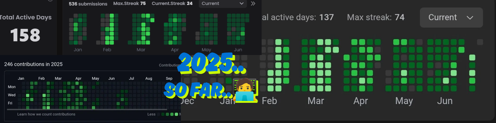

# Hi 👋, I'm Subrat Kumar Singh

### MCA'26 USICT | Data Science | Machine Learning, Artificial Intelligence Learner | C++, Python, Java | #LearnInPublic #ImproveDaily #Programming

  

  

- 🔭 I'm currently working on **ContentForgeAI - AI Content Creation Platform**

- 🌱 I'm currently learning **Data Science, Data Analyst, Data Warehousing, ETL-Tools, NumPy, Pandas, Flask, FastAPI, ML, DL**

- 🤝 I'm looking for help with **learning more about Data Science, AI/ML concepts**

- 💬 Ask me about **Data Warehouse, Snowflake, Pyhton, C++, Flask, SQL**

- 📫 How to reach me **subratsingh2001@gmail.com**

- ⚡ Fun fact **Without data, you’re just another person with an opinion.**

- 📄 Know about my experiences **[https://drive.google.com/drive/folders/1VcvfD3o5WeGV97XPYQ0w_xy0x5i7p92J?usp=drive_link](https://drive.google.com/drive/folders/1VcvfD3o5WeGV97XPYQ0w_xy0x5i7p92J?usp=drive_link)**

<h3 align="left">Connect with me:</h3>

<h3 align="left">Languages and Tools:</h3>

                     

&nbsp;

